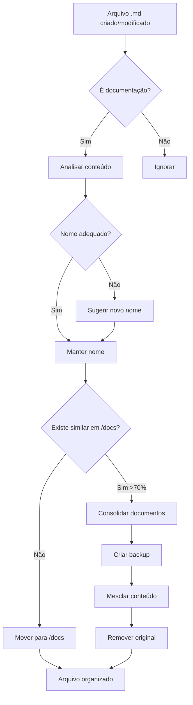

# ESTRUTURA-ORGANIZADOR-COMPLETA

## 🏗️ Estrutura do Sistema Organizador

### 1. Versões do Agente

| Versão | Arquivo | Modo | Função |
|--------|---------|------|--------|
| **Dedup Agent** | `src/organization-dedup-agent.ts` | Manual | Análise única e relatório |
| **Monitor Agent** | `src/organization-monitor-agent.ts` | **AUTÔNOMO** ✅ | Monitora e organiza continuamente |
| **Universal Agent** | `src/universal-consolidator-agent.ts` | Manual | Analisa todos tipos de arquivo |

### 2. Estrutura de Pastas

```
claude-flow/
├── config/                           # ← TODOS os docker-compose AQUI
│   ├── docker-compose.yml
│   ├── docker-compose.auto-commit.yml
│   ├── docker-compose.auto-organization.yml
│   ├── docker-compose.auto-push.yml
│   └── docker-compose.org-agent.yml  # ← Agente organizador
│
├── docs/                             # ← Destino automático dos .md
│   ├── AGENTE-*.md                   # Docs sobre agentes
│   ├── DOCKER-*.md                   # Docs sobre Docker
│   ├── ORGANIZATION-*.md             # Docs sobre organização
│   └── ORGANIZATION-STATUS.md        # Relatório automático
│
├── src/
│   ├── agents/                       # Agentes diversos
│   ├── base-agent.ts                 # Classe base
│   ├── organization-dedup-agent.ts   # Organizador manual
│   ├── organization-monitor-agent.ts # Organizador autônomo
│   └── universal-consolidator-agent.ts # Consolidador universal
│
├── scripts/                          # Scripts bash
│   ├── start-organization-monitor.sh
│   └── start-auto-organization.sh
│
└── .backups/                         # Backups automáticos
    └── auto-consolidation/
        └── 2024-12-06/               # Por data
            └── *.md                  # Arquivos consolidados
```

### 3. Fluxo do Agente Monitor (Autônomo)



### 4. Padrões de Nomenclatura

#### Documentos Finalizados
```
PREFIXO-TÓPICO-STATUS.md

Exemplos:
- AGENTE-AUTO-COMMIT-FUNCIONAL.md
- DOCKER-SETUP-COMPLETO.md
- ORGANIZATION-GUIDE-FINAL.md
```

#### Prefixos Temáticos
- `AGENTE-`: Documentação sobre agentes
- `DOCKER-`: Configurações e setup Docker
- `SYNC-`: Sincronização e git
- `ORGANIZATION-`: Organização e estrutura
- `ARQUITETURA-`: Design e arquitetura

#### Sufixos de Status
- `-SUCCESS`: Implementação bem-sucedida
- `-COMPLETO`: Documentação completa
- `-FINAL`: Versão final
- `-FUNCIONAL`: Testado e funcionando
- `-WIP`: Work in Progress
- `-DRAFT`: Rascunho

### 5. Comandos Principais

```bash
# Executar agente monitor (autônomo)
npm run agent:org-monitor

# Executar com Docker
npm run docker:org-agent

# Testar organização
npm run test:org-agent

# Demonstração
npx tsx examples/demo-org-monitor.ts
```

### 6. Configuração do Docker Compose

```yaml
# config/docker-compose.org-agent.yml
services:
  organization-agent:
    command: npm run agent:org-monitor
    volumes:
      - ./docs:/app/docs        # Documentos
      - ./src:/app/src          # Código
      - ./.backups:/app/.backups # Backups
    environment:
      - CHECK_INTERVAL=300000   # 5 minutos
      - ENABLE_AUTO_ORGANIZATION=true
```

### 7. Variáveis de Configuração

```typescript
{
  processDelay: 10000,      // Aguarda 10s após mudança
  autoMove: true,           // Move para /docs automaticamente
  autoConsolidate: true,    // Consolida documentos similares
  minSimilarity: 0.7,       // 70% similaridade para consolidar
  watchPatterns: ['**/*.md'], // Monitora apenas .md
  ignorePatterns: [         // Ignora estas pastas
    '**/node_modules/**',
    '**/.git/**',
    '**/dist/**'
  ]
}
```

### 8. Logs e Monitoramento

```bash
# Ver logs do Docker
docker logs claude-flow-org-agent -f

# Ver processo local
ps aux | grep organization-monitor

# Ver relatório de status
cat docs/ORGANIZATION-STATUS.md
```

## 💡 Regras Importantes

1. **TODOS os docker-compose vão em /config/**
2. **Documentos .md são movidos automaticamente para /docs**
3. **Backups sempre criados antes de consolidar**
4. **Nomenclatura MAIÚSCULA para docs finais**
5. **Monitor roda continuamente em background**

## 🔄 Memória Persistente

Esta estrutura foi salva na memória persistente (mem0) com as seguintes entidades:
- **Agente Organizador Claude-Flow**: Sistema completo
- **Estrutura de Configuração Docker**: Padrão /config
- **Padrões de Nomenclatura Documentos**: Convenções

Para recuperar: `mem0_search_memory("agente organizador")`