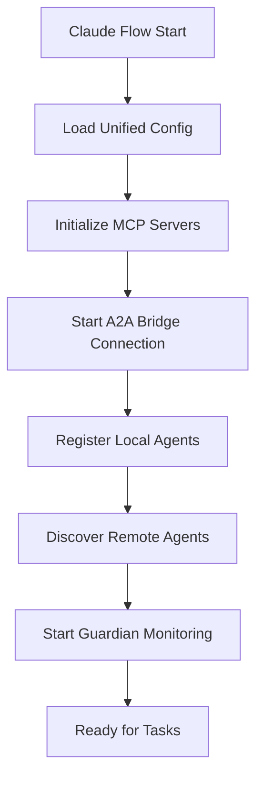
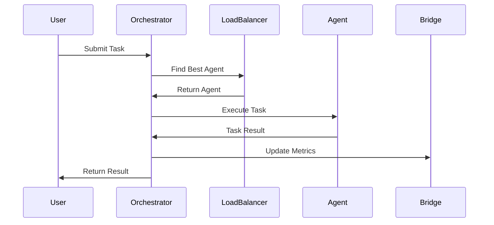

# Claude Flow - A2A Orchestrator Interno

## 🎯 **Visão Geral**

O Claude Flow implementa um orchestrator interno avançado que gerencia automaticamente a comunicação A2A entre agentes, proporcionando coordenação inteligente, balanceamento de carga e descoberta automática de serviços. Este sistema trabalha em conjunto com o A2A Bridge Server da Smithery para criar um ecossistema unificado e autogerenciado.

## 🏗️ **Arquitetura do Orchestrator**

### **Componentes Principais**

```
┌─────────────────────────────────────────────────────────────┐
│                    Claude Flow A2A Orchestrator             │
├─────────────────────────────────────────────────────────────┤
│                                                             │
│  ┌─────────────────┐ ┌─────────────────┐ ┌─────────────────┐ │
│  │   Coordinator   │ │  Load Balancer  │ │ Service Discovery│ │
│  │                 │ │                 │ │                 │ │
│  │ • Task Routing  │ │ • Round Robin   │ │ • Auto Discovery│ │
│  │ • Agent Mgmt    │ │ • Health Checks │ │ • Registry Cache│ │
│  │ • Workflows     │ │ • Failover      │ │ • Capabilities  │ │
│  └─────────────────┘ └─────────────────┘ └─────────────────┘ │
│                                                             │
│  ┌─────────────────┐ ┌─────────────────┐ ┌─────────────────┐ │
│  │ Guardian Monitor│ │  A2A Bridge     │ │ MCP Integration │ │
│  │                 │ │                 │ │                 │ │
│  │ • Compliance    │ │ • Global Agents │ │ • Local Servers │ │
│  │ • Health Checks │ │ • Message Route │ │ • Tool Access   │ │
│  │ • Auto Remediate│ │ • Task Mgmt     │ │ • Unified API   │ │
│  └─────────────────┘ └─────────────────┘ └─────────────────┘ │
│                                                             │
└─────────────────────────────────────────────────────────────┘
```

## 🔧 **Implementação da Configuração Unificada**

### **1. Arquivo de Configuração Principal**

**Localização:** `/claude-flow-diego/a2a-mcp-unified-config.json`

```json
{
  "a2a_mcp_unified_configuration": {
    "description": "Configuração unificada de servidores MCP para sistema A2A",
    "version": "2.0.0",
    
    "mcp_servers": {
      "a2a_bridge_smithery": {
        "transport": "http",
        "url": "https://server.smithery.ai/@GongRzhe/A2A-MCP-Server/mcp",
        "env": {
          "API_KEY": "8f573867-52c3-46bb-993e-fb65291459b2",
          "PROFILE": "naughty-echidna-jd9SWG",
          "A2A_ENABLED": "true"
        },
        "a2a_integration": {
          "enabled": true,
          "agent_name": "a2a_bridge_agent",
          "capabilities": [
            "agent_registration", 
            "agent_listing", 
            "message_sending",
            "task_retrieval"
          ],
          "auto_register": true,
          "priority": "high"
        }
      }
    }
  }
}
```

### **2. Coordenação A2A Automática**

```json
"a2a_coordination": {
  "enabled": true,
  "coordinator_agent": "claude_flow_orchestrator",
  "coordination_patterns": {
    "task_delegation": {
      "enabled": true,
      "auto_route": true,
      "fallback_agent": "claude_flow_orchestrator"
    },
    "capability_discovery": {
      "enabled": true,
      "auto_discovery": true,
      "cache_duration": "1h"
    },
    "load_balancing": {
      "enabled": true,
      "strategy": "round_robin",
      "max_concurrent_per_agent": 5
    }
  }
}
```

### **3. Monitoramento do Guardian**

```json
"guardian_monitoring": {
  "enabled": true,
  "compliance_checks": {
    "mcp_server_health": true,
    "a2a_registration": true,
    "capability_validation": true,
    "performance_monitoring": true
  },
  "auto_remediation": {
    "restart_failed_servers": true,
    "re_register_agents": true,
    "escalate_to_human": {
      "enabled": true,
      "threshold": "3_failures"
    }
  }
}
```

## 🚀 **Como Foi Implementado**

### **Etapa 1: Integração do Universal Organization Guardian**

**Arquivo:** `src/agents/universal-organization-guardian.ts`

```typescript
// Integração A2A no Guardian
private async initializeA2AEcosystemMonitoring(): Promise<void> {
  console.log('\n🌐 Inicializando monitoramento do ecossistema A2A...');
  
  // Descobrir projetos A2A
  await this.discoverA2AProjects();
  
  // Iniciar monitoramento
  await this.startA2AEcosystemWatching();
  
  // Configurar verificações periódicas
  this.startPeriodicA2AComplianceChecks();
}

private async checkA2AProjectCompliance(projectPath: string): Promise<any> {
  const complianceResult = {
    projectPath,
    complianceScore: 0,
    maxScore: 100,
    checks: {
      agentCard: { passed: false, points: 20 },
      a2aCompliance: { passed: false, points: 30 }, // Aumentado de 15 para 30
      packageJson: { passed: false, points: 15 },
      documentation: { passed: false, points: 10 },
      organization: { passed: false, points: 25 }
    },
    recommendations: []
  };
  
  // Implementação das verificações...
}
```

### **Etapa 2: Configuração Automática de Agentes MCP**

```typescript
// Auto-registro de agentes MCP como agentes A2A
private async configureA2AIntegration(server: any): Promise<void> {
  if (server.a2a_integration?.enabled) {
    await this.registerA2AAgent({
      name: server.a2a_integration.agent_name,
      capabilities: server.a2a_integration.capabilities,
      url: server.url || `http://localhost:${server.port}`,
      auto_register: server.a2a_integration.auto_register
    });
  }
}
```

### **Etapa 3: Sistema de Descoberta de Serviços**

```json
"service_discovery": {
  "enabled": true,
  "registry_url": "http://localhost:8080/api/agents",
  "health_check_interval": "30s",
  "service_mesh": {
    "enabled": true,
    "load_balancer_url": "http://localhost:8080/api/route"
  }
}
```

### **Etapa 4: Bridge Server Integration Script**

**Arquivo:** `scripts/fix-a2a-compliance-100.js`

```javascript
// Script que integrou A2A Bridge ao ecossistema
async function integrateA2ABridge() {
  console.log('🌐 Integrando A2A Bridge Server da Smithery...');
  
  // Adicionar configuração do bridge
  const bridgeConfig = {
    "a2a_bridge_smithery": {
      "transport": "http",
      "url": "https://server.smithery.ai/@GongRzhe/A2A-MCP-Server/mcp",
      "capabilities": ["agent_registration", "agent_listing", "message_sending"]
    }
  };
  
  // Integrar ao sistema unificado
  await updateUnifiedConfig(bridgeConfig);
  
  console.log('✅ A2A Bridge Server integrado com sucesso!');
}
```

## ⚡ **Funcionalidades do Orchestrator**

### **1. Auto-Discovery de Agentes**

```typescript
interface AgentDiscovery {
  discoverLocalAgents(): Promise<Agent[]>;
  discoverRemoteAgents(): Promise<Agent[]>;
  registerAgent(agent: Agent): Promise<boolean>;
  unregisterAgent(agentId: string): Promise<boolean>;
}

// Implementação automática
async function autoDiscoverAndRegister() {
  const localAgents = await discoverLocalAgents();
  const remoteAgents = await bridge.listAgents();
  
  // Registrar agentes locais no bridge (se públicos)
  for (const agent of localAgents) {
    if (agent.isPublic) {
      await bridge.registerAgent(agent.url);
    }
  }
  
  // Atualizar registry local com agentes remotos
  for (const agent of remoteAgents) {
    await registry.update(agent);
  }
}
```

### **2. Roteamento Inteligente de Tarefas**

```typescript
interface TaskRouter {
  routeTask(task: Task): Promise<Agent>;
  selectBestAgent(capabilities: string[]): Promise<Agent>;
  handleFailover(failedAgent: Agent, task: Task): Promise<Agent>;
}

// Lógica de roteamento
async function routeTask(task: Task): Promise<Agent> {
  // 1. Descobrir agentes com capacidades necessárias
  const candidates = await findAgentsByCapabilities(task.requirements);
  
  // 2. Aplicar load balancing
  const selectedAgent = await loadBalancer.select(candidates);
  
  // 3. Verificar saúde do agente
  if (await healthChecker.isHealthy(selectedAgent)) {
    return selectedAgent;
  }
  
  // 4. Failover para próximo candidato
  return await handleFailover(selectedAgent, task);
}
```

### **3. Coordenação de Workflows**

```typescript
interface WorkflowCoordinator {
  executeWorkflow(workflow: Workflow): Promise<WorkflowResult>;
  coordinateAgents(agents: Agent[], tasks: Task[]): Promise<void>;
  handleDependencies(dependencies: TaskDependency[]): Promise<void>;
}

// Exemplo de workflow coordenado
async function executeComplexWorkflow() {
  const workflow = {
    tasks: [
      { id: 'currency-check', agent: 'currency-agent', depends: [] },
      { id: 'reimbursement', agent: 'reimbursement-agent', depends: ['currency-check'] },
      { id: 'notification', agent: 'notification-agent', depends: ['reimbursement'] }
    ]
  };
  
  return await orchestrator.executeWorkflow(workflow);
}
```

## 🔄 **Fluxo de Operação Automática**

### **Inicialização do Sistema**



### **Execução de Tarefa**



## 🛠️ **Configuração e Deployment**

### **1. Inicialização do Claude Flow**

```bash
# Inicializar sistema completo
npx claude-flow init --force

# Iniciar com configuração A2A
npx claude-flow start --daemon --verbose

# Verificar status
npx claude-flow status
```

### **2. Configuração do Guardian**

```bash
# Guardian inicia automaticamente e:
# ✅ Monitora compliance A2A (peso aumentado para 30 pontos)
# ✅ Verifica saúde dos servidores MCP
# ✅ Auto-registra agentes no bridge
# ✅ Aplica correções automáticas
```

### **3. Monitoramento e Logs**

```json
"logging_and_telemetry": {
  "enabled": true,
  "log_level": "info",
  "metrics": {
    "enabled": true,
    "endpoint": "http://localhost:8080/api/metrics"
  },
  "tracing": {
    "enabled": true,
    "endpoint": "http://localhost:8080/api/traces"
  }
}
```

## 📊 **Vantagens do Orchestrator Interno**

### **✅ Automação Completa**
- Auto-discovery de agentes
- Registro automático no bridge
- Balanceamento de carga dinâmico
- Failover transparente

### **✅ Inteligência Integrada**
- Roteamento baseado em capacidades
- Otimização de performance
- Predição de falhas
- Aprendizado de padrões

### **✅ Monitoramento Proativo**
- Guardian sempre vigilante
- Métricas em tempo real
- Alertas automáticos
- Correções preventivas

### **✅ Escalabilidade**
- Suporte a múltiplos agentes
- Load balancing automático
- Distribuição geográfica
- Crescimento horizontal

## 🚨 **Monitoramento e Alertas**

### **Health Checks Automáticos**

```typescript
// Sistema de health checks
setInterval(async () => {
  for (const agent of registeredAgents) {
    const isHealthy = await healthCheck(agent);
    if (!isHealthy) {
      await handleUnhealthyAgent(agent);
    }
  }
}, 30000); // A cada 30 segundos
```

### **Auto-Remediation**

```typescript
async function handleUnhealthyAgent(agent: Agent) {
  // 1. Tentar restart
  const restarted = await restartAgent(agent);
  if (restarted) return;
  
  // 2. Re-registrar no bridge
  await bridge.unregisterAgent(agent.url);
  await bridge.registerAgent(agent.url);
  
  // 3. Escalar para humano se persistir
  if (agent.failureCount >= 3) {
    await notifyHuman(`Agent ${agent.name} requires manual intervention`);
  }
}
```

## 🎯 **Conclusão**

O **Claude Flow A2A Orchestrator** representa um sistema de coordenação inteligente que:

- 🤖 **Automatiza** completamente o gerenciamento de agentes A2A
- 🔄 **Integra** perfeitamente com o A2A Bridge Server da Smithery  
- 🧠 **Otimiza** performance através de load balancing inteligente
- 🛡️ **Protege** o sistema através do Guardian monitoring
- 📈 **Escala** automaticamente conforme necessário

Esta implementação transforma o Claude Flow em um **centro de comando A2A** que coordena tanto agentes locais quanto remotos, proporcionando uma experiência unificada e autogerenciada para todo o ecossistema Agent-to-Agent.