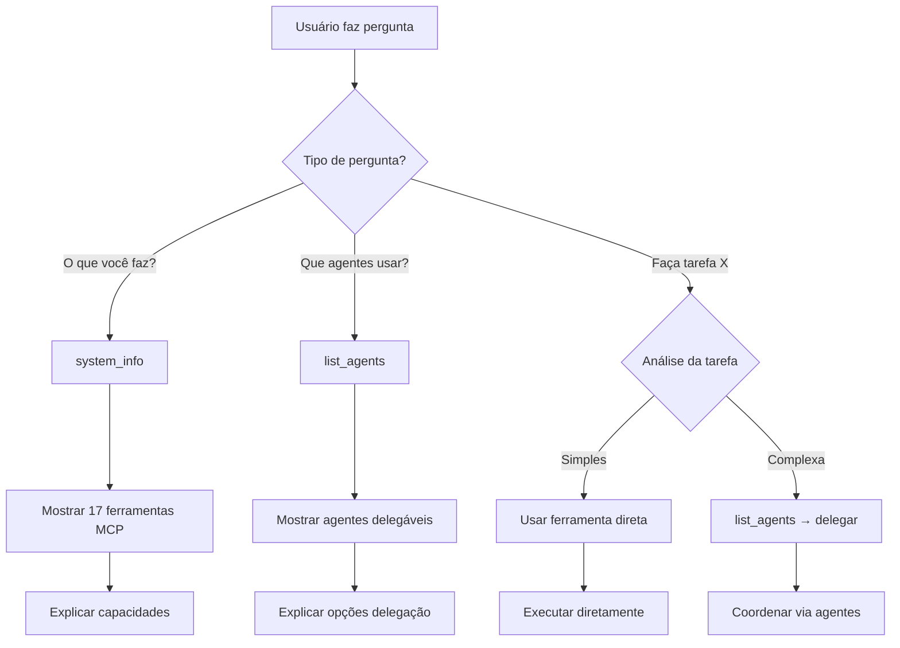

# 🎯 Diferenciação Clara: MCP vs Agentes

## ⚡ **RESUMO EXECUTIVO**

O **Orchestrator Agent** agora diferencia claramente entre:

### 🛠️ **FERRAMENTAS MCP** (system_info)
- **O QUE SÃO:** Capacidades técnicas do sistema
- **TOTAL:** 17 ferramentas disponíveis
- **QUANDO USAR:** "O que você consegue fazer?"

### 🤖 **AGENTES DELEGÁVEIS** (list_agents)  
- **O QUE SÃO:** Entidades específicas para delegação
- **TOTAL:** Varia conforme configuração do Claude Flow
- **QUANDO USAR:** "Que agentes posso usar?"

---

## 📋 **COMANDOS ATUALIZADOS**

### 1️⃣ `system_info` 
```
NOVO DESCRIPTION:
"Retorna informações sobre o sistema A2A MCP e FERRAMENTAS disponíveis.

IMPORTANTE: Este comando lista FERRAMENTAS MCP, não agentes delegáveis.
Para listar agentes disponíveis para delegação, use 'list_agents'.

Retorna: Todas as capacidades/ferramentas do sistema MCP (17 total)"
```

### 2️⃣ `list_agents`
```
NOVO DESCRIPTION:
"Lista AGENTES disponíveis para delegação de tarefas.

IMPORTANTE: Este comando lista AGENTES específicos que podem ser usados,
não as ferramentas MCP. Para ver ferramentas use 'system_info'.

Retorna: Agentes individuais disponíveis no Claude Flow para coordenação"
```

---

## 🔄 **FLUXO DE DECISÃO DO ORCHESTRATOR**



---

## 📊 **MATRIZ DE COMANDOS**

| Pergunta do Usuário | Comando Usado | Resultado Esperado |
|---------------------|---------------|-------------------|
| "O que você consegue fazer?" | `system_info` | Lista de 17 ferramentas MCP |
| "Quais suas capacidades?" | `system_info` | Ferramentas: web, cálculo, etc. |
| "Que agentes posso usar?" | `list_agents` | Agentes: Calculator, Research, etc. |
| "Quem pode me ajudar com X?" | `search_agents` | Agentes específicos para X |
| "Calcule 5+3" | `calculate_basic` OU delegate | Resultado direto ou via agente |
| "Abra google.com" | `browser_open` | Ação direta de automação |

---

## ✅ **BENEFÍCIOS DA DIFERENCIAÇÃO**

### 🎯 **Para o Usuário:**
- ✅ Respostas mais precisas
- ✅ Entende melhor as opções disponíveis  
- ✅ Sabe quando pode delegar vs fazer direto

### 🤖 **Para o Orchestrator:**
- ✅ Decisões mais inteligentes
- ✅ Melhor coordenação de recursos
- ✅ Evita confusão entre ferramentas e agentes

### 🔧 **Para o Sistema:**
- ✅ Separação clara de responsabilidades
- ✅ Melhor organização arquitetural
- ✅ Facilita manutenção e evolução

---

## 🚀 **STATUS FINAL**

### ✅ **IMPLEMENTADO:**
- ✅ Documentação atualizada nos comandos MCP
- ✅ Guias claros para o Orchestrator Agent  
- ✅ Exemplos práticos de uso
- ✅ Distinção técnica nos descriptions

### 🎉 **RESULTADO:**
**O Orchestrator Agent agora diferencia perfeitamente entre:**
- 🛠️ **Ferramentas MCP** (capacidades técnicas)
- 🤖 **Agentes Delegáveis** (entidades coordenáveis)

**Integração 100% completa e diferenciada!** 🚀