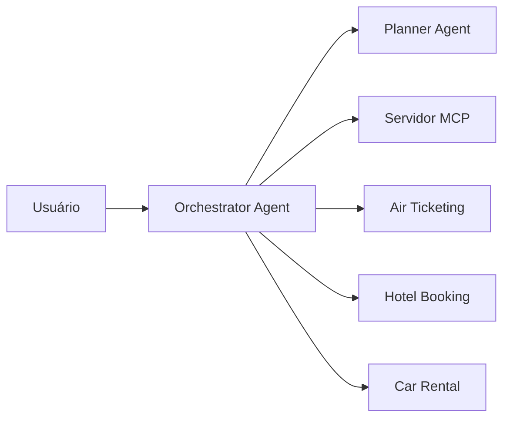

# Sistema A2A MCP - Guia Rápido

Sistema de agentes A2A (Agent-to-Agent) com MCP (Model Context Protocol) para coordenação de tarefas de viagem.

## 🚀 Início Rápido

### Pré-requisitos
```bash
# Instalar UV (se não tiver)
curl -LsSf https://astral.sh/uv/install.sh | sh

# Configurar chave do Google
export GOOGLE_API_KEY="sua_chave_aqui"
```

### Executar Sistema Completo
```bash
# Navegar para o diretório
cd agents/a2a_mcp

# Opção 1: Usando script personalizado
python start_a2a_mcp.py

# Opção 2: Usando módulo
python -m a2a_mcp

# Opção 3: Usando uv
uv run python start_a2a_mcp.py
```

### Executar Agentes Individuais
```bash
# Apenas o orchestrator
python start_a2a_mcp.py --agent orchestrator

# Apenas o planner
python start_a2a_mcp.py --agent planner

# Apenas air ticketing
python start_a2a_mcp.py --agent air_ticketing
```

## 🔧 Configuração

### Verificar Configuração
```bash
python start_a2a_mcp.py --config
```

### Variáveis de Ambiente
```bash
# Obrigatória
export GOOGLE_API_KEY="sua_chave_google"

# Opcional
export GOOGLE_PLACES_API_KEY="sua_chave_places"
export A2A_LOG_LEVEL="INFO"
```

## 🏗️ Arquitetura

### Componentes
1. **Servidor MCP** (porta 10100) - Registry de agentes
2. **Orchestrator Agent** (porta 10101) - Coordena tarefas
3. **Planner Agent** (porta 10102) - Planeja viagens
4. **Air Ticketing Agent** (porta 10103) - Reserva voos
5. **Hotel Booking Agent** (porta 10104) - Reserva hotéis
6. **Car Rental Agent** (porta 10105) - Aluga carros

### Fluxo de Trabalho


## 🎯 Exemplos de Uso

### Teste via API
```bash
# Testar orchestrator
curl -X POST http://localhost:10101/tasks/send \
  -H "Content-Type: application/json" \
  -d '{
    "message": {
      "role": "user",
      "parts": [{"kind": "text", "text": "Planejar viagem para Londres"}],
      "messageId": "test-123",
      "contextId": "test-context"
    }
  }'
```

### Planejamento de Viagem
```json
{
  "message": {
    "role": "user", 
    "parts": [{"kind": "text", "text": "Planejar viagem de São Francisco para Londres de 12 a 20 de maio"}],
    "messageId": "trip-456",
    "contextId": "trip-context"
  }
}
```

## 📋 Comandos Úteis

### Gerenciamento
```bash
# Mostrar status
python start_a2a_mcp.py --status

# Parar todos (Ctrl+C no terminal do sistema)

# Verificar logs
tail -f logs/a2a_mcp.log  # se configurado
```

### Desenvolvimento
```bash
# Instalar dependências
uv sync

# Executar testes
uv run pytest  # se houver testes

# Executar linter
uv run ruff check src/
```

## 🔍 Troubleshooting

### Problemas Comuns

1. **Erro de GOOGLE_API_KEY**
   ```bash
   export GOOGLE_API_KEY="sua_chave_aqui"
   ```

2. **Porta já em uso**
   ```bash
   # Verificar processos
   lsof -i :10100
   lsof -i :10101
   # Matar processo se necessário
   kill -9 <PID>
   ```

3. **Dependências não instaladas**
   ```bash
   uv sync
   ```

4. **Arquivo de banco não encontrado**
   ```bash
   # Verificar se travel_agency.db existe
   ls -la travel_agency.db
   ```

### Logs e Debug
```bash
# Habilitar logs detalhados
export A2A_LOG_LEVEL="DEBUG"

# Executar com saída detalhada
python start_a2a_mcp.py --agent orchestrator 2>&1 | tee debug.log
```

## 🌟 Funcionalidades

### Agentes Especializados
- **Orchestrator**: Coordena todo o fluxo
- **Planner**: Quebra requisições em tarefas
- **Air Ticketing**: Busca e reserva voos
- **Hotel Booking**: Busca e reserva hotéis
- **Car Rental**: Aluga veículos

### Tecnologias
- **A2A Protocol**: Comunicação entre agentes
- **MCP**: Registry e descoberta de agentes
- **Google Gemini**: LLM para processamento
- **SQLite**: Base de dados de viagens
- **FastAPI**: APIs REST
- **Server-Sent Events**: Streaming em tempo real

## 📞 Suporte

Para mais informações, consulte:
- [README completo](README.md)
- [Documentação A2A](../../docs/)
- [Configuração avançada](a2a_mcp_config.py)

## 🎉 Pronto para Usar!

O sistema agora está configurado para rodar de forma similar ao HelloWorld agent, com gerenciamento simplificado e configuração centralizada! 