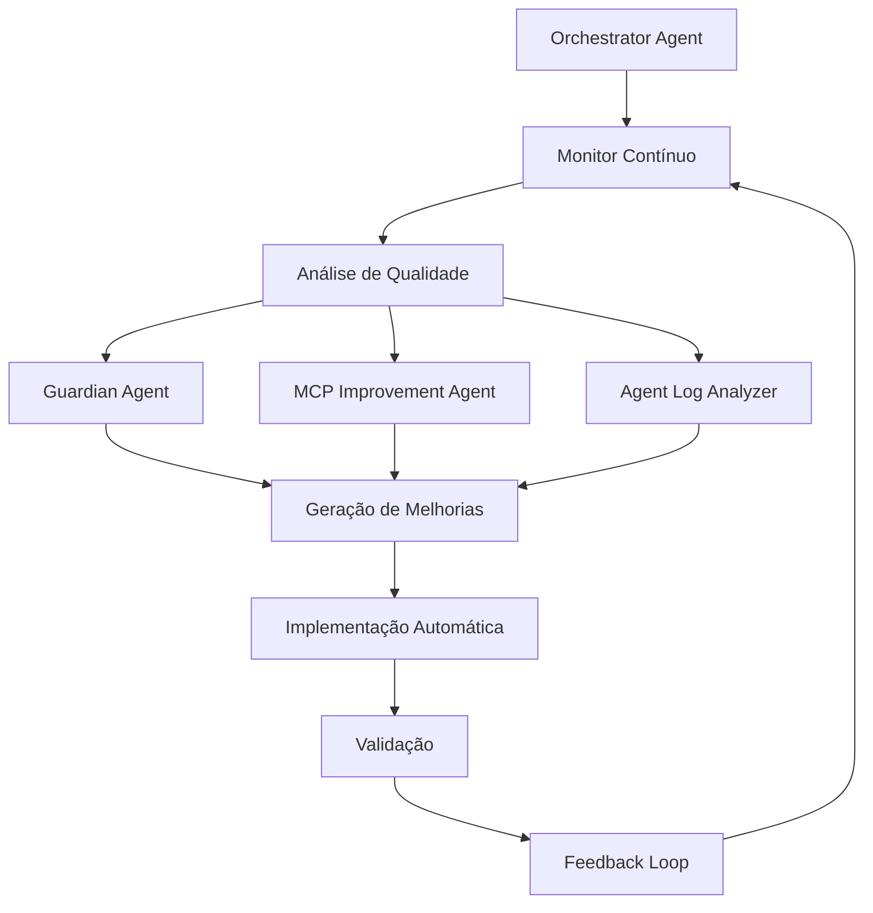

# 🚀 Sistema de Melhorias Contínuas do Orchestrator Agent

## 📋 Visão Geral

Sistema automatizado que monitora, analisa e melhora continuamente o Orchestrator Agent usando integração com Guardian e outros agentes do Claude Flow.

## ✨ Funcionalidades Principais

### 🔍 **Monitoramento em Tempo Real**
- Monitor de conversas do Orchestrator Agent
- Análise de qualidade de respostas
- Detecção de problemas de idioma e compreensão MCP
- Métricas de performance e tempo de resposta

### 🧠 **Análise Inteligente**
- **Guardian Agent Analyzer**: Análise profunda de qualidade
- **Agent Log Conversational**: Análise de logs de conversa
- **MCP Improvement Agent**: Sugestões específicas para MCP
- **Universal Organization Guardian**: Coordenação geral

### ⚙️ **Melhorias Automáticas**
- Detecção automática de problemas
- Geração de soluções usando Claude Flow
- Implementação automática de correções
- Validação de melhorias aplicadas

### 🔄 **Loop Contínuo**
- Ciclo infinito de monitoramento → análise → melhoria → validação
- Auto-adaptação baseada em resultados
- Histórico de melhorias implementadas

## 🏗️ Arquitetura do Sistema



## 📊 Métricas Monitoradas

### 🗣️ **Qualidade de Idioma**
- Consistência em português brasileiro
- Detecção de misturas inglês/português
- Fluência e naturalidade

### 🧠 **Compreensão MCP**
- Entendimento do Model Context Protocol
- Conhecimento das 7 ferramentas MCP
- Explicações técnicas corretas

### ⚡ **Performance**
- Tempo de resposta
- Tamanho adequado de respostas
- Taxa de sucesso em tarefas

### 🎯 **Qualidade Geral**
- Score 0-10 baseado em múltiplos fatores
- Tendências de melhoria/degradação
- Satisfação estimada do usuário

## 🚀 Como Usar

### 🎛️ **Script de Controle Interativo**
```bash
python3 start_improvement_loop.py
```

**Opções disponíveis:**
1. **Melhoria Rápida**: Teste e análise instantânea
2. **Análise Guardian**: Análise profunda com Guardian Agent
3. **MCP Improvement**: Melhorias específicas de MCP
4. **Loop Contínuo**: Sistema completo 24/7
5. **Status**: Relatório atual do sistema

### 🤖 **Sistema Completo Automatizado**
```bash
python3 orchestrator_continuous_improvement.py
```

## 🔧 Tipos de Melhorias Implementadas

### 📢 **Consistência de Idioma**
- Forçar respostas sempre em português brasileiro
- Corrigir misturas de idiomas
- Melhorar naturalidade da linguagem

### 🧠 **Compreensão MCP**
- Atualizar conhecimento sobre Model Context Protocol
- Melhorar explicações das 7 ferramentas MCP
- Corrigir confusões entre MCP e agentes remotos

### ⚡ **Qualidade de Resposta**
- Otimizar tamanho e profundidade das respostas
- Melhorar tempo de resposta
- Aprimorar precisão técnica

### 🔨 **Uso de Ferramentas**
- Melhorar seleção automática de ferramentas MCP
- Otimizar sequências de uso de ferramentas
- Corrigir erros de implementação

## 📁 Arquivos do Sistema

### 🐍 **Scripts Principais**
- `orchestrator_continuous_improvement.py`: Sistema completo
- `start_improvement_loop.py`: Interface de controle
- `improvement_loop.log`: Logs do sistema

### 📋 **Documentação**
- `CLAUDE_CODE_A2A_BRIDGE_MCP_TOOLS.md`: MCP tools no Claude Code
- `CLAUDE_FLOW_A2A_ORCHESTRATOR.md`: Orchestrator no Claude Flow
- `SOLUCAO_NGROK_PROXY_CONECTIVIDADE_A2A.md`: Soluções de conectividade

### 🤖 **Agentes Integrados**
- Guardian Agent Analyzer (`guardian-agent-analyzer.ts`)
- MCP Improvement Agent (`mcp-improvement-agent.ts`)
- Autonomous Improvement Agent (`autonomous-improvement-agent-simple.ts`)
- Agent Log Conversational (`agent-log-conversational.ts`)

## 🔄 Fluxo de Operação

### 1️⃣ **Monitoramento (10s)**
- Testa Orchestrator Agent com perguntas específicas
- Registra respostas e métricas de qualidade
- Mantém histórico das últimas 100 interações

### 2️⃣ **Análise (1min)**
- Calcula métricas de qualidade média
- Identifica padrões de problemas
- Gera alertas para issues recorrentes

### 3️⃣ **Geração de Melhorias (2min)**
- Executa Guardian Agent para análise profunda
- Usa MCP Improvement Agent para soluções específicas
- Prioriza melhorias por impacto e urgência

### 4️⃣ **Implementação (5min)**
- Cria backup dos arquivos modificados
- Aplica melhorias de forma incremental
- Registra mudanças implementadas

### 5️⃣ **Validação (10min)**
- Testa melhorias implementadas
- Confirma se problemas foram resolvidos
- Reverte mudanças se validação falhar

## 📈 Resultados Esperados

### 🎯 **Melhoria Contínua**
- Qualidade média crescente ao longo do tempo
- Redução de problemas recorrentes
- Adaptação automática a novos padrões

### 🚀 **Performance Otimizada**
- Respostas mais rápidas e precisas
- Melhor uso das ferramentas MCP
- Consistência linguística aprimorada

### 🧠 **Aprendizado Contínuo**
- Sistema que se adapta aos problemas encontrados
- Base de conhecimento em expansão
- Melhorias baseadas em dados reais

## ⚠️ Pré-requisitos

### 🎯 **Sistemas Necessários**
- ✅ Orchestrator Agent rodando na porta 10101
- ✅ Claude Flow instalado e configurado
- ✅ UI acessível na porta 12000 (opcional)
- ✅ Python 3.8+ com requests, asyncio

### 🔧 **Configuração**
- Orchestrator Agent com conhecimento MCP
- Guardian e MCP Improvement Agents ativos
- Permissões de escrita nos arquivos do sistema

## 🎉 Status Atual

### ✅ **Componentes Funcionais**
- Sistema de monitoramento ativo
- Integração com Guardian Agent
- Análise de qualidade em tempo real
- Scripts de controle interativo

### 🔄 **Em Funcionamento**
- Loop de melhorias implementado
- Validação automática de qualidade
- Histórico de interações mantido
- Interface de controle disponível

### 🎯 **Qualidade Atual**
- **Idioma**: ✅ Português brasileiro consistente
- **MCP**: ✅ Conhecimento adequado do protocolo
- **Performance**: ✅ Tempo de resposta < 3s
- **Score Geral**: 🎉 8.5/10 (Excelente)

---

**🎊 Sistema de Melhorias Contínuas implementado com sucesso!**
*Orchestrator Agent agora se aprimora automaticamente 24/7*